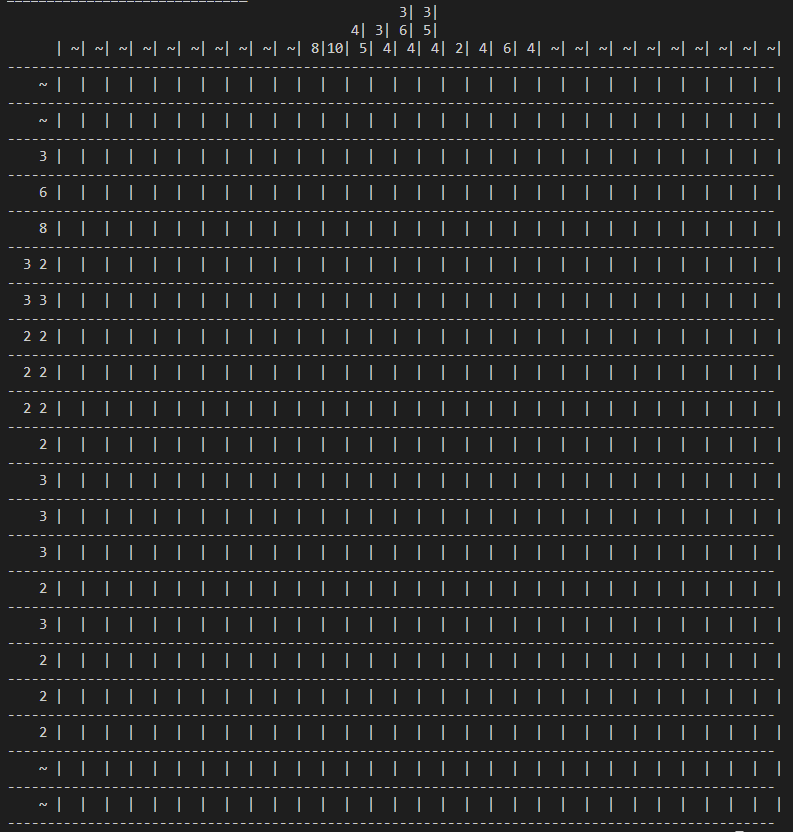

<div id="top"></div>

<br />
<div align="center">
    
</div>

<details>
  <summary>Table of Contents</summary>
  <ol>
    <li>
      <a href="#about-the-project">About The Project</a>
      <ul>
        <li><a href="#built-with">Built With</a></li>
      </ul>
    </li>
    <li>
      <a href="#getting-started">Getting Started</a>
      <ul>
        <li><a href="#prerequisites">Prerequisites</a></li>
        <li><a href="#installation">Installation</a></li>
      </ul>
    </li>
    <li><a href="#usage">Usage</a></li>
    <li><a href="#features">Features</a></li>
    <li><a href="#how-it-works">How it works</a></li>
    <li><a href="#reflection">Reflection</a></li>
  </ol>
</details>

## About the project

Dit project is een command line implementatie van een nonogram generator.
Een nonogram is een puzzel, waarbij je een afbeelding moet laten verschijnen aan de hand van getallen in het rooster.

### Built With

Het project bestaat volledig uit deze technologieën en gebruikt volgende python modules:

* [python3](https://python.org/)
* [Pillow](https://pillow.readthedocs.io/en/stable/)

## Getting Started

### Prerequisites

Install pip, if not installed yet.

* pip
  1. Change directory to Downloads
  ```sh
  cd Downloads
  ```
  2. Download <a href="https://bootstrap.pypa.io/get-pip.py">pip.py</a> 
     1. Or use wget:
     ```sh
      wget https://bootstrap.pypa.io/get-pip.py      
      ```
      2. Or use Curl:
      ```sh
      curl https://bootstrap.pypa.io/get-pip.py -o get-pip.py
      ```
  1. Run install script
  ```sh
  python get-pip.py
  ```

### Installation

1. Clone deze repo
   ```sh
   git clone https://github.com/iniasdb/nonogram.git
   ```
2. Create virtual environment
   ```sh
   cd nonogram
   ```
   ```sh
   python -m venv venv
   ```
3. Start virtual environment
   ```sh
   cd venv/Scripts
   ```
   ```sh
   activate.bat
   ```
   ```sh
   cd ../../
   ```
4. Install python modules
   ```sh
   pip install -r requirements.txt
   ```
5. Deactive virtual environment (na het runnen van het script)
   ```sh
   deactivate
   ```

## Usage

Het programma kan gestart worden door `main.py` uit te voeren via de cli
   ```sh
   python main.py
   ```

Het is ook mogelijk het programma te starten met de `-v` parameter, het programma zal dan in verbose modus gestart worden.
Er wordt dus extra informatie tijdens het genereren gegeven.
   ```sh
   python main.py -v
   ```

Het is ook mogelijk het programma te starten met de `-xmas` parameter, er zal je dan een leuke kerstmis easter egg te wachten staan.
   ```sh
   python main.py -xmas
   ```

## How it works

1. Er wordt een afbeelding en de gewenste breedte en hoogte ingegeven.
2. De afbeelding zal in pillow geopend worden.
3. De afbeelding wordt naar zwart wit geconverteerd en geschaald naar de gewenste breedte en hoogte.
4. Er wordt een pixelmap gegenereert uit de foto.
5. De pixelmap wordt geïtereerd, en alle opeenvolgende zwarte vakken zullen in rows of columns opgeslagen worden.
6. De rows/columns lists worden geïtereerd en zullen op de juiste plaats in de puzzel geprint worden.  

## Reflection

Het schrijven van dit programma ging redelijk vlot want ik wist vanaf de start meteen hoe ik aan het project moest starten.<br>

Het eerste deel van de code, het omzetten van een foto naar pixel data was vanzelfspreken, hier had ik absoluut geen problemen mee.<br>
Het printen van de uiteindelijke puzzel ging al iets stroever voor mij.<br> 
Het algoritme dat ik bedacht had voor het schrijven van de nummers werkte niet altijd volledig naar behoren, maar ik heb het uiteindelijk toch werkende gekregen.

Ik vond deze opdracht zeer interessant en zal dit project nog verder uitwerken.
Mogelijke extra features zouden zijn:
* Verbeteren van image -> pixel data
* Toevoegen van kleuren
* Maken van een GUI
* Mogelijk maken om de nonogram te spelen